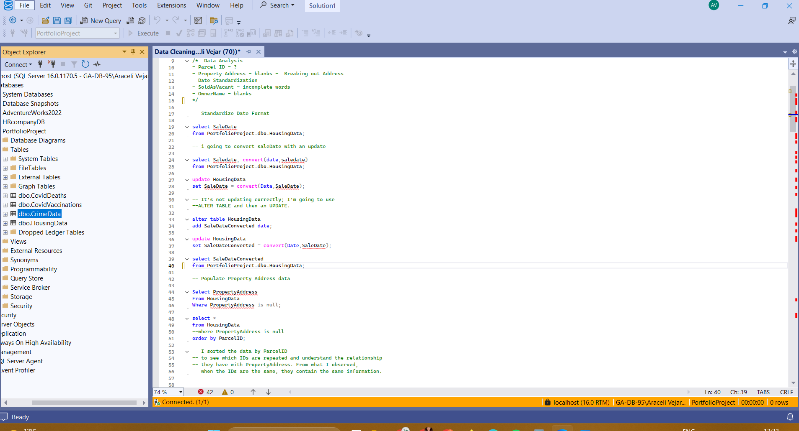

# HousingData-Data Cleaning-SQL

This project focuses on **cleaning and preparing housing data using SQL Server** to improve data quality and make the dataset ready for analysis.

The cleaning process included:
- standardizing date format
- filling missing property addresses
- splitting address fields into separate columns
- converting inconsistent values in `SoldAsVacant`
- identifying duplicate records
- removing unnecessary columns
  
**Dataset**
Housing Dataset: https://www.kaggle.com/datasets/tmthyjames/nashville-housing-data

**Tools Used**
- SQL Server Management Studio (SSMS)
- Excel

**SQL Techniques Used**
- `ALTER TABLE`
- `UPDATE`
- `CONVERT()`
- `ISNULL()`
- `SUBSTRING()`
- `CHARINDEX()`
- `PARSENAME()`
- `CASE WHEN`
- `ROW_NUMBER()`
- `CTE`
- `SELF JOIN`
  
**Project Preview SQL Data Cleaning Script **

## Conclusion

This project helped me improve my SQL skills by working on a real data cleaning process.  
I learned how to transform messy data into a cleaner and more structured dataset for future analysis.
